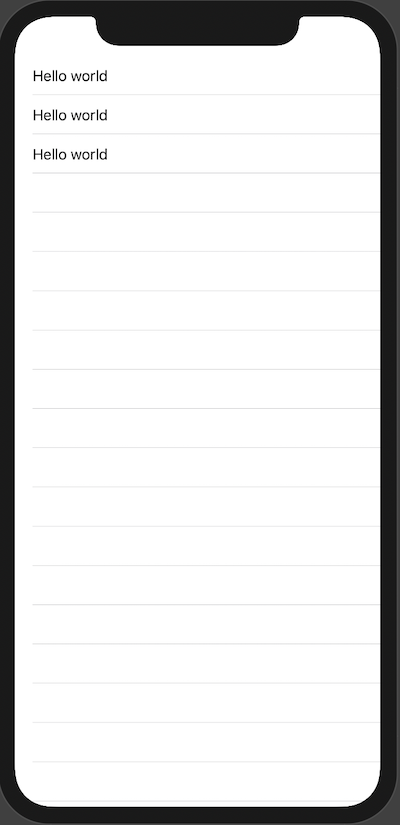
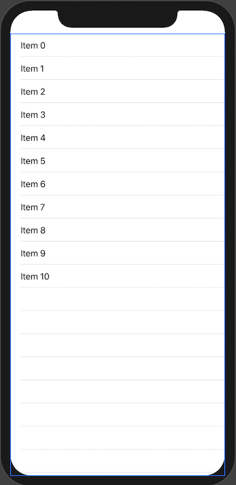
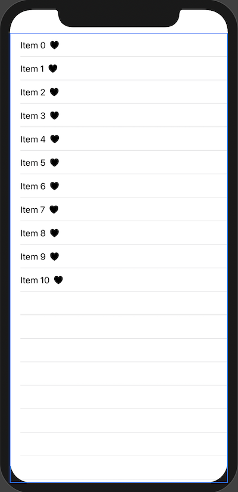
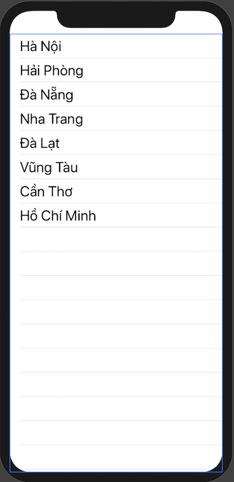

# Simple List of static items

​		Chào mừng bạn đã tới bài viết này của mình. Nếu bạn là dev iOS hay dev mobile thì việc hiển thị một danh sách là điều hầu như bắt buộc khi làm app. Với UIKit thì chúng ta có `UITableView` thần thánh. Còn với `SwiftUI` thì chúng ta có `List`. Hãy bắt đầu thôi bằng việc tạo 1 danh sách đơn giản nhất với dữ liệu tĩnh.

### Bắt đầu

​		Cú pháp hiển thị 1 List đơn giản nhất có thể

```swift
List {
    Text("Hello world")
    Text("Hello world")
    Text("Hello world")
}
```




​		Tiết kiệm thời gian chút

```swift
List(0...10) { index in
   Text("Item \(index)")
}
```

​		Với cú pháp này thì ta có 11 phần tử chạy từ 0 đến 10. Các row sẽ có nội dung là các biến `index`.



​		Thử với chút pha trộn cho sinh động.

```swift
List(0...10) { index in
   Text("Item \(index)")
   Image(systemName: "suit.heart.fill")
}
```



### Nâng cấp

​		Thêm dữ liệu cho List

```swift
let names: [String] = ["Hà Nội",
                           "Hải Phòng",
                           "Đà Nẵng",
                           "Nha Trang",
                           "Đà Lạt",
                           "Vũng Tàu",
                           "Cần Thơ",
                           "Hồ Chí Minh"]
```

​		Tiến tới custom List cho hiển thị được dữ liệu từ array trên.

```swift
List(0..<names.count) { index in
            Text(self.names[index])
                .font(.title)
}
```

​		Kết quả như sau.



​		*Cảm ơn bạn đã đọc và theo dõi bài viết này. Ngoài ra, bạn muốn xem trực quan sinh động hơn thì có thể xem ở link video sau.*

>[https://youtu.be/155kkshFZC8](https://youtu.be/155kkshFZC8)

---

### Danh sách  [Working with List](../)

---

